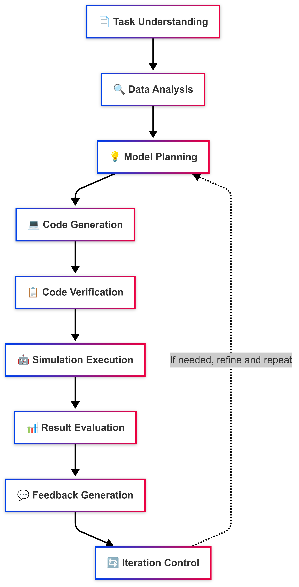

<p align="center">
  
</p>

# 🌆 SOCIA: Simulation Orchestration for City Intelligence and Agents

An LLM-driven multi-agent social simulation generator that automatically creates simulation environments based on user requirements and data.

<!-- Illustration Image Placeholder -->
<p align="center">
  
</p>
<!-- Replace this with your actual architecture diagram -->

## 🏗️ Architecture

The system implements a distributed multi-agent architecture where each agent performs specialized tasks:

1. **Task Understanding Agent**: Parses user requirements
2. **Data Analysis Agent**: Analyzes real-world data
3. **Model Planning Agent**: Designs simulation approach and structure
4. **Code Generation Agent**: Transforms plans into Python code
5. **Code Verification Agent**: Tests generated code
6. **Simulation Execution Agent**: Runs simulations in sandbox
7. **Result Evaluation Agent**: Compares simulation with real data
8. **Feedback Generation Agent**: Creates improvement suggestions
9. **Iteration Control Agent**: Coordinates the workflow

## 🔧 Installation

```bash
pip install -r requirements.txt
```

## ⚙️ Configuration

### API Key

The system uses OpenAI's API for the LLM-based agents. The API key is hardcoded in the `keys.py` file:

```python
# keys.py
OPENAI_API_KEY = "your-key-here"
```

You can use the included setup script to configure your API key:
```bash
python main.py --setup-api-key
```

This script will create or update the `keys.py` file with your API key.

### 🤖 Language Model Selection

SOCIA supports multiple large language model providers. You can easily switch between them by editing the `config.yaml` file:

```yaml
# In config.yaml
llm:
  provider: "gemini"  # options: openai, gemini, anthropic, llama
```

Available LLM providers and their configurations:

- **OpenAI (GPT models)**
  ```yaml
  llm_providers:
    openai:
      model: "gpt-4o"  # options: gpt-4o, gpt-4-turbo, gpt-3.5-turbo, etc.
      temperature: 0.7
      max_tokens: 4000
  ```

- **Google Gemini**
  ```yaml
  llm_providers:
    gemini:
      model: "models/gemini-2.5-flash-preview-04-17"  # options: gemini-2.5-flash-preview, gemini-pro, etc.
      temperature: 0.7
      max_tokens: 8192
  ```

- **Anthropic Claude**
  ```yaml
  llm_providers:
    anthropic:
      model: "claude-3-opus-20240229"  # options: claude-3-opus, claude-3-sonnet, etc.
      temperature: 0.7
      max_tokens: 4000
  ```

To use a specific LLM provider:
1. Make sure you have the appropriate API key in `keys.py`
2. Update the `llm.provider` field in `config.yaml`
3. Adjust provider-specific parameters in the `llm_providers` section if needed

## 🚀 Usage

### Example Commands

Here are some example commands to help you get started with SOCIA:

```bash
# Display help information and available command-line options
python main.py --help
```

This command shows all available options and parameters for running SOCIA, including task description, output directories, and other configuration options.

```bash
# Run the built-in example simulation
python main.py --run-example
```

This command runs a pre-configured epidemic simulation example to demonstrate the system's capabilities. It's a good starting point to verify that your installation is working correctly.

```bash
# Run a full workflow with a specific task
python main.py --task "Create a simple epidemic simulation model that models the spread of a virus in a population of 1000 people." --output "./output/my_sim_output"
```

This command initiates the full SOCIA workflow:
1. LLM agents analyze the task description
2. The system designs and generates an epidemic simulation for a city of 1000 people
3. The simulation is executed and results are saved to the "./my_sim_output" directory
4. Visualizations and analysis are automatically generated

Use this command pattern when you want to create custom simulations based on your specific requirements. You can customize the task description to focus on different urban simulation scenarios.

### Running Custom Simulations

When running a simulation with a custom task, the system:
1. Parses your requirements using natural language processing
2. Selects appropriate models based on the task context
3. Generates and validates the simulation code
4. Executes the simulation in a controlled environment
5. Produces results and visualizations

For more advanced usage, see the examples directory for sample scripts that demonstrate specific simulation types.

## 📁 Project Structure

- `agents/`: Individual agent implementations
- `core/`: Core simulation framework
- `data/`: Data management utilities
- `models/`: Simulation model templates
- `orchestration/`: Agent coordination
- `utils/`: Utility functions
- `tests/`: Test suite 

## 📝 Log

SOCIA includes a comprehensive logging system that records all aspects of the simulation generation and execution process:

- 🔍 **Detailed Execution Logs**: The system automatically records INFO, WARNING, and ERROR level messages
- 📂 **Output Directory Integration**: Logs are saved directly in your output project directory
- 🔄 **LLM Model Tracking**: Every LLM call is logged with the specific model version used
- 🕒 **Timestamped Entries**: All log entries include precise timestamps for debugging and analysis

To view logs for a simulation run:
```bash
# Logs are automatically saved in your output directory
cat ./your_output_directory/socia.log

# Example for checking LLM model usage
grep "Using Gemini model" ./your_output_directory/socia.log
```

This logging system is invaluable for:
- Debugging simulation generation issues
- Tracking LLM model performance and usage
- Analyzing the workflow execution process
- Understanding agent decision-making

Log settings can be configured in the `config.yaml` file:
```yaml
logging:
  level: "INFO"  # Options: DEBUG, INFO, WARNING, ERROR, CRITICAL
  format: "%(asctime)s - %(name)s - %(levelname)s - %(message)s"
``` 