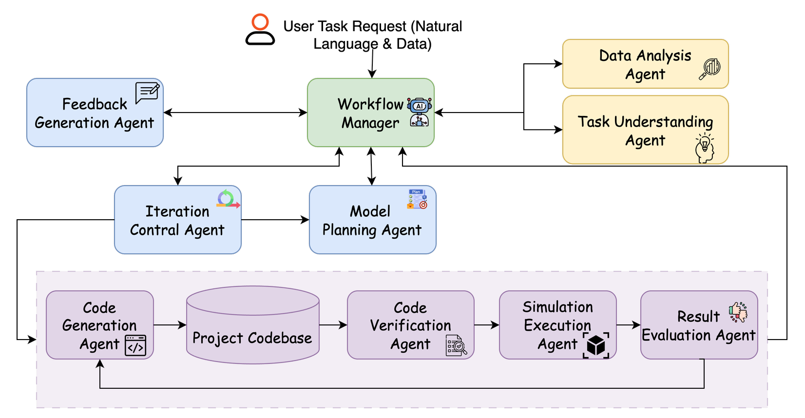

<p align="center">
  
</p>

# 🌆 SOCIA: Simulation Orchestration for Cyber-Physical-Social Intelligence and Agents

[//]: # (<p align="center"><i>The work is still in progress...</i></p>)

An LLM-driven multi-agent Cyber-Physical-Social simulation generator that automatically creates simulation environments based on user requirements and data.

For more details about SOCIA, please check out our [paper on arXiv](https://arxiv.org/abs/2505.12006).

If you use SOCIA in your research, please cite:
```bibtex
@article{DBLP:journals/corr/abs-2505-12006,
  author       = {Yuncheng Hua and
                  Ji Miao and
                  Mehdi Jafari and
                  Jianxiang Xie and
                  Hao Xue and
                  Flora D. Salim},
  title        = {{SOCIA:} An End-to-End Agentic Framework for Automated Cyber-Physical-Social
                  Simulator Generation},
  journal      = {CoRR},
  volume       = {abs/2505.12006},
  year         = {2025},
  url          = {https://doi.org/10.48550/arXiv.2505.12006},
  doi          = {10.48550/ARXIV.2505.12006},
  eprinttype    = {arXiv},
  eprint       = {2505.12006},
  timestamp    = {Tue, 24 Jun 2025 07:37:11 +0200},
  biburl       = {https://dblp.org/rec/journals/corr/abs-2505-12006.bib},
  bibsource    = {dblp computer science bibliography, https://dblp.org}
}
```

<!-- Illustration Image Placeholder -->
<p align="center">
  
</p>
<!-- Replace this with your actual architecture diagram -->

## 🏗️ Architecture

The system implements a distributed multi-agent architecture where each agent performs specialized tasks:

1. **Task Understanding Agent**: Parses user requirements
2. **Data Analysis Agent**: Analyzes real-world data
3. **Model Planning Agent**: Designs simulation approach and structure
4. **Code Generation Agent**: Transforms plans into Python code
5. **Code Verification Agent**: Tests generated code
6. **Simulation Execution Agent**: Runs simulations in sandbox
7. **Result Evaluation Agent**: Compares simulation with real data
8. **Feedback Generation Agent**: Creates improvement suggestions
9. **Iteration Control Agent**: Coordinates the workflow

## 🔧 Installation

```bash
pip install -r requirements.txt
```

### 🐳 Docker Installation (Required for Sandbox Isolation)

SOCIA uses Docker for isolated code execution and verification. You need to install Docker on your system to fully utilize the code verification and simulation execution features.

**Please be kindly noted: 
Always keep Docker running while using SOCIA for social simulation creation.**

#### Linux
```bash
# Update package index
sudo apt-get update

# Install prerequisites
sudo apt-get install apt-transport-https ca-certificates curl software-properties-common

# Add Docker's official GPG key
curl -fsSL https://download.docker.com/linux/ubuntu/gpg | sudo apt-key add -

# Add Docker repository
sudo add-apt-repository "deb [arch=amd64] https://download.docker.com/linux/ubuntu $(lsb_release -cs) stable"

# Install Docker CE
sudo apt-get update
sudo apt-get install docker-ce

# Start Docker service
sudo systemctl start docker

# Enable Docker to start on boot
sudo systemctl enable docker

# Add your user to the docker group to run Docker without sudo
sudo usermod -aG docker $USER
```

#### macOS
The easiest way to install Docker on macOS is using Docker Desktop:

1. Download Docker Desktop for Mac from [Docker's official website](https://www.docker.com/products/docker-desktop)
2. Install the application by dragging it to your Applications folder
3. Launch Docker Desktop and follow the setup wizard
4. Verify installation with: `docker --version`

## ⚙️ Configuration

### 🔑 API Key

The system uses OpenAI's API for the LLM-based agents. The API key is hardcoded in the `keys.py` file:

```python
# keys.py
OPENAI_API_KEY = "your-key-here"
```

You can use the included setup script to configure your API key:
```bash
python main.py --setup-api-key
```

This script will create or update the `keys.py` file with your API key.

### 🤖 Language Model Selection

SOCIA supports multiple large language model providers. You can easily switch between them by editing the `config.yaml` file:

```yaml
# In config.yaml
llm:
  provider: "gemini"  # options: openai, gemini, anthropic, llama
```

Available LLM providers and their configurations:

- **OpenAI (GPT models)**
  ```yaml
  llm_providers:
    openai:
      model: "gpt-4o"  # options: gpt-4o, gpt-4-turbo, gpt-3.5-turbo, etc.
      temperature: 0.7
      max_tokens: 4000
  ```

- **Google Gemini**
  ```yaml
  llm_providers:
    gemini:
      model: "models/gemini-2.5-flash-preview-04-17"  # options: gemini-2.5-flash-preview, gemini-pro, etc.
      temperature: 0.7
      max_tokens: 8192
  ```

- **Anthropic Claude**
  ```yaml
  llm_providers:
    anthropic:
      model: "claude-3-opus-20240229"  # options: claude-3-opus, claude-3-sonnet, etc.
      temperature: 0.7
      max_tokens: 4000
  ```

To use a specific LLM provider:
1. Make sure you have the appropriate API key in `keys.py`
2. Update the `llm.provider` field in `config.yaml`
3. Adjust provider-specific parameters in the `llm_providers` section if needed

### 📁 Supported File Types for DataAnalysisAgent

The `DataAnalysisAgent` is capable of reading and analyzing the following file types:

- **CSV Files** (`.csv`): Used for tabular data analysis.
- **JSON Files** (`.json`): Supports standard JSON format for structured data.
- **GeoJSON Files** (`.geojson`): A specialized format for encoding geographic data structures.
- **Pickle Files** (`.pkl`): Used for loading serialized Python objects, such as network structures.

Ensure that the files are correctly formatted to allow for successful analysis.

## 🚀 Usage

### 💻 Example Commands

Here are some example commands to help you get started with SOCIA:

```bash
# Display help information and available command-line options
python main.py --help
```

This command shows all available options and parameters for running SOCIA, including task description, output directories, and other configuration options.

```bash
# Run a full workflow with a specific task using `Manual Mode` as the default mode.
python main.py --task "Create a simple epidemic simulation model that models the spread of a virus in a population of 1000 people." --output "./output/my_sim_output_hitl"
```

This command initiates the full SOCIA workflow:
1. LLM agents analyze the task description
2. The system designs and generates an epidemic simulation for a city of 1000 people
3. The simulation is executed and results are saved to the "./my_sim_output" directory
4. Visualizations and analysis are automatically generated
5. The default mode is **Manual Mode** (`--auto=False`) where user provides manual feedback in each iteration and manually stop iteration by entering `#STOP#`.

Use this command pattern when you want to create custom simulations based on your specific requirements. You can customize the task description to focus on different urban simulation scenarios.

```bash
# Run a multi-agent urban resident simulation with LLM prompting
export PROJECT_ROOT="/Users/Your_User_Name/PycharmProjects/SOCIA" && export DATA_PATH="data_fitting/llmob_data/" && python main.py --task "Develop a multi-agent simulation system to simulate the daily activity trajectories of urban residents based on LLM prompting." --task-file examples/llmob_task.json --output ./output/llmob_sim_output
```

If we also want to feed data into SOCIA for simulator establishment, this command sets up environment variables for data paths and initiates a complex multi-agent simulation focused on urban resident activities. It uses:
1. Project root and data path environment variables to specify data locations
2. A detailed task description for the simulation focus (urban resident daily activities)
3. Additional parameters from a task file for more complex configuration
4. LLM prompting techniques to generate realistic human behaviors and trajectories

This advanced configuration demonstrates how SOCIA can leverage LLM capabilities to model complex human behaviors in urban environments with high fidelity.

```bash
# Run LLM-based agent reasoning simulation with explicit OpenAI API calls
conda activate SOCIA && export OPENAI_API_KEY="your-openai-api-key-here" && export PROJECT_ROOT="/Users/Your_User_Name/PycharmProjects/SOCIA" && export DATA_PATH="data_fitting/agent_society/" && python main.py --task "Develop a multi-agent simulation system to simulate the review and star a use will comment on a product. Do not use transformers to predict review or stars (conduct reasoning), you should call the provided openai key to construct LLM agent to do the reasoning." --task-file examples/agent_society.json --output ./output/agent_society_output_hitl_openaitest
```

**Important Note for LLM Agent Reasoning Simulations**: This example demonstrates how to run SOCIA when the generated agents need to make **explicit API calls to OpenAI** for reasoning tasks. This is particularly useful for:

1. **Agent-based reasoning scenarios**: When your simulation requires agents to perform complex reasoning using LLM capabilities
2. **Review and recommendation systems**: Agents that need to generate realistic reviews, ratings, or recommendations
3. **Social media simulations**: Where agents post comments, reactions, and engage in discussions
4. **Decision-making simulations**: Agents that need to make intelligent choices based on context

**Key Environment Variables**:
- `OPENAI_API_KEY`: Your OpenAI API key for the generated agents to use
- `PROJECT_ROOT`: Absolute path to your SOCIA project directory
- `DATA_PATH`: Relative path to your data files within the project

**When to use this pattern**:
- The simulation task explicitly mentions "reasoning", "LLM", or "intelligent behavior"
- You want agents to generate dynamic, contextual responses rather than using pre-trained models
- The simulation involves natural language generation tasks (reviews, comments, discussions)
- You need agents that can adapt their behavior based on complex decision-making processes

Replace `"your-openai-api-key-here"` with your actual OpenAI API key and adjust the paths according to your system setup.

### 🎯 Auto Mode vs Manual Mode

SOCIA supports two modes of operation to give you control over the feedback process:

1. **Manual Mode** (`--auto=False` or default): User provides manual feedback in each iteration
2. **Automatic Mode** (`--auto=True` or `--auto`): System generates all feedback automatically

#### Manual Mode Usage (Default) - Human-in-the-Loop

```bash
python main.py --task "Your simulation task"
# or explicitly:
python main.py --task "Your simulation task" --auto=False
```

Manual mode enables **Human-in-the-Loop (HITL)** functionality, giving you complete control over the iterative simulation development process. In this mode, you actively participate in refining and improving the simulation through direct feedback.

##### 🔄 Interactive Feedback Loop

After each iteration, you will be prompted to provide feedback in an interactive session:

```
================================================================================
MANUAL FEEDBACK INPUT - ITERATION 2/100
================================================================================
Current iteration completed. Review the generated code and results.

Please provide your feedback for the current iteration.
This feedback will be used to improve the simulation code in the next iteration.
You can include suggestions for:
- Code improvements or bug fixes
- Model accuracy enhancements  
- Performance optimizations
- Visualization improvements
- Parameter adjustments
- Any other observations or recommendations

SPECIAL COMMANDS:
- Type "#STOP#" to terminate the iteration process
- Press Enter twice (empty input) to skip feedback and continue with system feedback only

Enter your feedback (press Enter twice to finish):
--------------------------------------------------------------------------------
```

To stop the iteration process at any time, simply enter `#STOP#` as your feedback.

#### Lite Mode - Simplified Workflow

SOCIA also provides a **Lite Mode** that offers a streamlined workflow for simpler simulation tasks. This mode is particularly useful when you want to:
- Quickly prototype a simulation
- Test simple models without complex data analysis
- Get immediate results with minimal setup

##### 🚀 Using Lite Mode with Human-in-the-Loop

Here's an example command that combines Lite Mode with human-in-the-loop feedback:

```bash
export PROJECT_ROOT="/path/to/your/SOCIA" && \
export DATA_PATH="output/test_result/" && \
python main.py --task "Create a simple epidemic simulation with SIR model" \
               --mode lite \
               --output ./output/lite_test_fixed_hitl
```

This command:
1. Sets up necessary environment variables:
   - `PROJECT_ROOT`: Points to your SOCIA installation directory
   - `DATA_PATH`: Specifies where simulation results will be saved
2. Runs SOCIA in lite mode (`--mode lite`)
3. Enables human-in-the-loop feedback by default
4. Generates a simple SIR epidemic model

In lite mode, you can still provide feedback after each iteration and use `#STOP#` to end the process when satisfied with the results.

##### 💡 Key Features of Lite Mode
- **Simplified workflow** with fewer agents (skips task understanding, data analysis, and model planning)
- **Faster iteration cycles** with streamlined processing
- **Direct code execution** using Python subprocess instead of Docker sandbox
- **Real-time output capture** displaying stdout, stderr, and return codes
- **Lightweight verification** without heavy Docker-based sandbox isolation
- **Direct feedback loop** with the system for rapid iteration
- **Suitable for educational and prototyping purposes**

##### 🔧 Lite Mode Execution Details

In Lite Mode, SOCIA now **executes the generated code directly** using Python's subprocess module instead of skipping execution entirely. This provides:

1. **Direct Code Execution**: Generated simulation code runs immediately in the host environment
2. **Real-time Output**: Complete stdout and stderr output is captured and displayed
3. **Performance Metrics**: Execution time and return codes are recorded
4. **Error Handling**: Runtime errors are captured and reported for debugging

**Example Execution Output:**
```
standard output（stdout）:
Starting sample simulation...
Project root: /Users/username/SOCIA
Data path: data/sample
Step 0: Simulation value = 0.123
Step 1: Simulation value = 0.456
...
Simulation completed successfully!

error info（stderr）:
[Any error messages appear here]

return code（returncode）:
0
```

This approach allows for rapid testing and iteration while maintaining the lightweight nature of Lite Mode, making it ideal for development and educational scenarios where Docker isolation is not required.

##### 🛑 Controlling Iteration Termination

You have **full control** over when to stop the iterative refinement process:

1. **Manual Termination**: Type `#STOP#` when you're satisfied with the simulation quality
2. **Automatic Continuation**: Provide feedback or skip (empty input) to continue improving
3. **Intelligent Limits**: The system uses soft limits (starting at 3 iterations) that expand automatically in manual mode, with a high hard limit (100 iterations by default)

**Example Termination Scenarios:**
```bash
# When satisfied with results:
Your feedback: #STOP#

# To continue refining:
Your feedback: Please add age-based contact matrices to the epidemic model.

# To skip this iteration but continue:
Your feedback: [Press Enter twice - empty input]
```

##### 📝 Feedback Guidelines and Best Practices (Examples)

**Effective Feedback Types:**

1. **Technical Improvements**
   ```
   The infection probability calculation is incorrect. It should use:
   P_infection = 1 - exp(-beta * contacts * dt)
   instead of the current linear approximation.
   ```

2. **Model Enhancements**
   ```
   Add spatial heterogeneity to the model:
   - Divide the population into geographic regions
   - Implement different contact rates between regions
   - Add commuting patterns between work and home locations
   ```

3. **Visualization Requests**
   ```
   Please add the following visualizations:
   - Time series plot of daily new infections
   - Geographic heat map of infection density
   - Age-stratified epidemic curves
   - Network visualization of transmission chains
   ```

4. **Parameter Adjustments**
   ```
   Update the model parameters based on COVID-19 data:
   - Incubation period: 5.1 days (not 3 days)
   - Recovery time: 14 days for mild cases, 21 days for severe
   - Case fatality rate: 1.4% overall, stratified by age
   ```

5. **Performance Optimizations**
   ```
   The simulation is too slow for large populations. Please:
   - Implement vectorized operations using NumPy
   - Use sparse matrices for contact networks
   - Add progress bars for long-running simulations
   ```

##### 🔧 Advanced Feedback Features

**Multi-aspect Feedback**: You can address multiple aspects in a single feedback session:
```
Feedback covering multiple areas:

BUGS:
- Fix the division by zero error in line 45 when population is 0
- The random seed is not being set, causing non-reproducible results

ENHANCEMENTS:
- Add vaccination rollout capability with age-based prioritization
- Implement behavioral changes (mask wearing, social distancing) as time-dependent parameters

VISUALIZATION:
- Create an animated plot showing the spread over time
- Add a dashboard-style summary with key metrics
```

**Iterative Refinement Strategy**: Use feedback to gradually build complexity:
```
Iteration 1: "Start with a simple SIR model"
Iteration 2: "Add age groups and contact matrices" 
Iteration 3: "Include spatial structure and mobility"
Iteration 4: "Add interventions and policy scenarios"
Iteration 5: "#STOP#" (when satisfied)
```

#### Automatic Mode Usage

```bash
python main.py --task "Your simulation task" --auto
```

In automatic mode, the system uses only AI-generated feedback without user intervention. This mode completes in fewer iterations (typically 3) and is suitable for quick prototypes or when human oversight is not required.

#### How User Feedback is Processed

**Feedback Priority System:**
1. **🥇 HIGHEST PRIORITY**: User manual feedback (when provided)
2. **🥈 MEDIUM PRIORITY**: System-generated feedback from evaluation agents
3. **🥉 LOWEST PRIORITY**: Default improvement suggestions

**Integration Process:**
1. **Parsing**: User feedback is analyzed and structured by the system
2. **Merging**: Combined with system feedback in a prioritized format
3. **Context Preservation**: Previous feedback history is maintained across iterations
4. **Targeted Application**: Feedback is mapped to specific code sections and improvements

**Feedback Persistence:**
- All feedback is logged in `{output_dir}/feedback_iter_{n}.json`
- User feedback is marked with highest priority flags
- System tracks which feedback items have been addressed in subsequent iterations

#### Benefits of Human-in-the-Loop Mode

- **🧠 Domain Expertise**: Incorporate specialized knowledge that AI might miss
- **🎯 Quality Control**: Human oversight ensures scientifically accurate and practically useful simulations
- **⚡ Real-time Customization**: Adapt the simulation direction based on emerging insights
- **🔍 Error Detection**: Catch logical errors, unrealistic assumptions, or implementation bugs
- **📚 Learning Opportunity**: Understand the iterative development process and system capabilities
- **🎛️ Fine-tuned Control**: Adjust the balance between automation and human guidance

**Use Cases for Manual Mode:**
- Research simulations requiring high accuracy
- Educational scenarios where understanding the process is important  
- Complex domains where domain expertise is critical
- Prototyping where requirements may evolve during development
- Quality assurance for production simulations

### 🧪 Running Custom Simulations

When running a simulation with a custom task, the system:
1. Parses your requirements using natural language processing
2. Selects appropriate models based on the task context
3. Generates and validates the simulation code
4. Executes the simulation in a controlled environment
5. Produces results and visualizations

For more advanced usage, see the examples directory for sample scripts that demonstrate specific simulation types.

## 🏃 Sandbox Isolation Environment

SOCIA implements a secure sandbox isolation environment using Docker containers for safely executing and validating generated simulation code. This approach ensures:

1. **Security**: Generated code runs in an isolated container with limited access to host resources
2. **Dependency Management**: Automatic installation and verification of required packages
3. **Error Detection**: Comprehensive execution monitoring and error reporting
4. **Resource Control**: Memory and CPU limitations to prevent resource exhaustion

### 🛡️ Code Verification Agent Sandbox

The Code Verification Agent uses a sandbox environment to perform a comprehensive verification of generated code:

1. **Syntax Verification**: Checks for syntax errors before execution
2. **Dependency Analysis**: Extracts imports and identifies required packages
3. **Dependency Installation**: Attempts to install all required packages in the sandbox
4. **Smoke Test Execution**: Runs a minimal test execution to verify basic functionality

When the system encounters verification issues, it will:
- Provide detailed error messages
- Generate suggestions for fixing the issues
- Allow for iterative improvement of the code

The verification process is implemented in `agents/code_verification/sandbox.py` and follows this workflow:
```
1. Syntax check → 2. Dependency analysis → 3. Docker sandbox creation → 4. Code execution → 5. Results collection
```

### 🖥️ Simulation Execution Agent Sandbox

The Simulation Execution Agent uses a similar Docker-based sandbox for safely running the full simulation:

1. **Environment Setup**: Creates a clean Docker container with Python
2. **Package Installation**: Installs common simulation packages (numpy, matplotlib, etc.)
3. **Metric Collection**: Injects code to collect performance and simulation metrics
4. **Execution Monitoring**: Tracks execution time, memory usage, and errors
5. **Results Extraction**: Captures simulation output and metrics for evaluation

If Docker is not available on your system, SOCIA will fall back to using the LLM to simulate the execution, which provides a less accurate but still useful approximation of the simulation results.

The execution sandbox is implemented in `agents/simulation_execution/agent.py` and follows a similar pattern to the verification sandbox, with additional focus on capturing simulation metrics and performance data.

Both sandbox implementations use the base `DockerSandbox` class that provides a secure, isolated execution environment with:

- Network access controls
- Memory limitations
- Execution timeouts
- File system isolation
- Standard output/error capturing 

## 📁 Project Structure

- `agents/`: Individual agent implementations
- `core/`: Core simulation framework
- `data/`: Data management utilities
- `models/`: Simulation model templates
- `orchestration/`: Agent coordination
- `utils/`: Utility functions
- `tests/`: Test suite 

## 📝 Log

SOCIA includes a comprehensive logging system that records all aspects of the simulation generation and execution process:

- 🔍 **Detailed Execution Logs**: The system automatically records INFO, WARNING, and ERROR level messages
- 📂 **Output Directory Integration**: Logs are saved directly in your output project directory
- 🔄 **LLM Model Tracking**: Every LLM call is logged with the specific model version used
- 🕒 **Timestamped Entries**: All log entries include precise timestamps for debugging and analysis

To view logs for a simulation run:
```bash
# Logs are automatically saved in your output directory
cat ./your_output_directory/socia.log

# Example for checking LLM model usage
grep "Using Gemini model" ./your_output_directory/socia.log
```

This logging system is invaluable for:
- Debugging simulation generation issues
- Tracking LLM model performance and usage
- Analyzing the workflow execution process
- Understanding agent decision-making

Log settings can be configured in the `config.yaml` file:
```yaml
logging:
  level: "INFO"  # Options: DEBUG, INFO, WARNING, ERROR, CRITICAL
  format: "%(asctime)s - %(name)s - %(levelname)s - %(message)s"
```

## 🤖 Agents

SOCIA employs a multi-agent architecture where specialized agents work together in a workflow to accomplish complex simulation tasks. Each agent leverages LLM capabilities for their specific domain responsibilities.

### 🧠 Task Understanding Agent

The Task Understanding Agent serves as the entry point to the SOCIA workflow, responsible for interpreting user requirements and creating a structured task specification:

1. **Natural Language Processing**
   - Parses unstructured or semi-structured user task descriptions
   - Extracts key requirements, constraints, and objectives
   - Identifies domain-specific terminology and concepts

2. **Task Formalization**
   - Converts natural language requirements into a formal, structured specification
   - Identifies required data files and their purposes
   - Establishes evaluation metrics for assessing simulation quality

3. **Contextual Understanding**
   - Recognizes the simulation domain (epidemiology, urban planning, etc.)
   - Identifies implicit requirements not explicitly stated by the user
   - Considers constraints that might affect simulation design

4. **Integration with Workflow**
   - Provides a clear, structured `task_spec` to downstream agents
   - Sets initial parameters and constraints for the entire simulation process
   - Creates a foundation for all subsequent agent activities

The Task Understanding Agent outputs a comprehensive JSON structure that serves as the blueprint for the entire simulation development process, ensuring all agents have a consistent understanding of user requirements.

### 📊 Data Analysis Agent

The Data Analysis Agent has been redesigned to leverage LLM capabilities for intelligent data analysis, understanding, and correction:

1. **LLM-Powered Intelligent Data Correction**
   - No longer relies on hardcoded rules for data analysis
   - Uses LLM to detect issues and suggest corrections
   - Automatically identifies and converts various boolean representations (strings "True"/"False", numbers 1/0)
   - Understands data context and semantics rather than just mechanical processing

2. **Enhanced Data Analysis Workflow**
   - **Intelligent Preprocessing**:
     - Reads raw data
     - Provides sample data and task description to LLM
     - LLM identifies potential data issues and correction methods
     - Automatically applies appropriate corrections based on LLM suggestions
   - **Deep Understanding**:
     - LLM explains meaning and context of each field
     - Detects patterns and relationships that might not be obvious
     - Identifies key features useful for simulation calibration
   - **Calibration Recommendations**:
     - Extracts key distributions, patterns, and relationships from data
     - Suggests how to use the data to calibrate the simulator
     - Provides specific parameter values and configuration suggestions

3. **Structured Output Optimization**
   - Produces detailed structured results including:
     - `data_summary`: Key patterns, distributions, and relationships in the data
     - `simulation_parameters`: Parameter values and recommendations extracted from data
     - `calibration_strategy`: Strategies for using data to calibrate the simulator
     - `processed_data`: Corrected and processed data
     - `file_info`: Detailed information and purpose for each file

4. **Downstream Agent Integration**
   - Provides high-quality inputs to the Model Planning Agent and Code Generation Agent:
     - Clearly communicates what information the data contains
     - Explains in detail how to use the data for simulation calibration
     - Delivers structured data and analysis results for easy processing

This redesign enables the Data Analysis Agent to function as a true LLM agent, leveraging powerful language model capabilities to understand and process data rather than relying on predefined rules and hardcoded logic.
